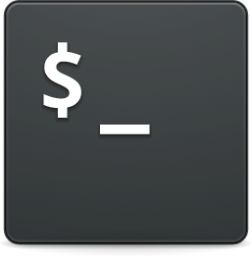

<br />
<div align = "center">
    <a href = "https://terminal.jefferyfang.com">
        
    </a>
    <p align = "center">
        A website about me reminiscent of the linux terminal, click icon for deployment
    </p>
</div>

## About The Project

This project is a alternate portfolio website based on the linux terminal. Navigation is done using common linux commands like 'ls', 'cat', etc. The project is deployed on
[terminal.jefferyfang.com](https://terminal.jefferyfang.com) feel free to check it out!

## Getting Started

To get a local version running follow these steps:

### Installation

1. Clone this repository

    ```sh
    git clone https://github.com/jfang324/terminal-website.git
    ```

2. Navigate to the project directory

    ```sh
    cd terminal-website
    ```

3. Install NPM packages

    ```sh
    npm install
    ```

4. Build and run with next.js if you want to check it out

    ```sh
    npm run build
    npm run start
    ```

5. Open your browser and navigate to [localhost:3000](http://localhost:3000) to access the application

6. To run the cypress tests (make sure you built the project first)

    ```sh
    npm run test
    ```

## Gallery & Demonstrations


</img>

_Desktop View_


</img>

_Light Mode Desktop View_


</img>

_Valorant Theme Desktop View_

<br />

## Contact

Jeffery Fang - Jefferyfang324@gmail.com

## Tools & Technologies

-   Next.js
-   TailwindCSS
-   React
-   Cypress
-   Vercel
